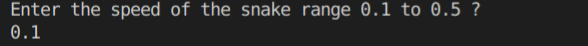

# Udacity C++ Nanodegree

## `Project: Capstone Snake Game Clone`

# Overview

This C++ project is the fifth and final project of the Udacity C++ Nanodegree.
The source code has been heavily adapted from the provided starter code located at (Udacity's repo)[https://github.com/udacity/CppND-Capstone-Snake-Game].
The code base can be divided architecturally and functionally into four distinct class-based components:

- Renderer component is responsible for rendering the state of the game using the popular [SDL library](https://www.libsdl.org/)

- Game component constructs and maintains the game board and placement of the game elements like the snake and food.

- Snake component constructs and maintains the snake object as it moves across the board gaining points and checking if it ran into itself.

- Controller component receives input from the user in order to control movement of the snake.

Once the game starts and creates the `Game`, `Controller`, and `Snake` objects, the game continues to loop through each component as it grabs input from the user, `Controller`, updates the state of the `Game`, and graphically renderers the state of the game, `Render`.

Upon lauching the game the user is then asked for the starting speed of the `snake`

The game board launches after the user provides a valid speed and the user is able to play the game by moving the snake around with the arrow keys.

## Dependencies for Running Locally

- cmake >= 3.7
  - All OSes: [click here for installation instructions](https://cmake.org/install/)
- make >= 4.1 (Linux, Mac), 3.81 (Windows)
  - Linux: make is installed by default on most Linux distros
  - Mac: [install Xcode command line tools to get make](https://developer.apple.com/xcode/features/)
  - Windows: [Click here for installation instructions](http://gnuwin32.sourceforge.net/packages/make.htm)
- SDL2 >= 2.0
  - All installation instructions can be found [here](https://wiki.libsdl.org/Installation)
  - Note that for Linux, an `apt` or `apt-get` installation is preferred to building from source.
- gcc/g++ >= 5.4
  - Linux: gcc / g++ is installed by default on most Linux distros
  - Mac: same deal as make - [install Xcode command line tools](https://developer.apple.com/xcode/features/)
  - Windows: recommend using [MinGW](http://www.mingw.org/)

## Basic Build Instructions

1. Clone this repo.
2. Make a build directory in the top level directory: `mkdir build && cd build`
3. Compile: `cmake .. && make`
4. Run it: `./SnakeGame`.

# Rubric Items Matched

### 1

### `Object Oriented Programming - The project uses Object Oriented Programming techniques.`

> The project code is organized into classes and virtual funtions with class attributes to hold the data, and class methods to perform tasks.
> Data members have been classified as appropriate access specifiers.

### 2

### `Class constructors utilize member initialization lists.`

> Class members that are set to argument values are initialized through member initialization lists.

The Game class has member variables `grid_width` and `grid_height` initialized using the initialization lists which are further passed into the Snake class constructor in the user function `SetSpeed` (game.cpp line 22).

### 3

### `Object Oriented Programming - Classes abstract implementation details from their interfaces.`

> One member function in an inherited class overrides a virtual base class member function. The BaseController abstract class is inherited by the Controller class and hence multiple controllers can be used.

> All class member functions document their effects, either through function names, comments, or formal documentation. Member functions do not change program state in undocumented ways.

The class controller from `controller.h` inherits from abstract class `BaseController.h`.

### 4

### `Loops, Functions, I/O - The project accepts user input and processes the input.`

> The project accepts input from a user as part of the necessary operation of the program.

The user has the option to select the starting speed of the snake. A Game class member variable  `speed` (main.cpp line 13) has the user input stored and this member varible is passed in the Game class constructor. The Game class private data member `speed_` is initialized through the initialization list. The main function also  validate the user's input and assigns a default value to the private member `speed`.

The player name is also taken as an input in the member variable `userName`.

> The function loops through the `grid_width` and `grid_height` to restrict and color the boundaries (renderer.cpp line 57).

### 5

### `The project makes use of references in function declarations.`

> The project has a function to set the speed of the snake which passes the snake speed by referencenin the function `SetSpeed(float &speed)`(game.cpp line 22). This function also makes sure the game begins once the speed of the snake is set and the following initializing of snake constructor is made. This hence sets the member varaible `speed_`.

### 6

### `The project uses move semantics to move data, instead of copying it, where possible.`

> The member function `HandleInput` takes the bool `running` using move semnatics being passed at (game.cpp line 28).

### 7

### `The project uses smart pointers instead of raw pointers.`

> The snake object is passed around the classes `renderer.cpp` and `controller.cpp` using the shared pointers `std::shared_ptr<Snake> snake;` (game.h line 21).

### 8

### `The project uses destructors appropriately.`

> The `main.cpp` takes the player name as an input into the varible `userName`. This is passed in the Game class constructor which dynamically allocates memory and is deleted in the destructor (game.cpp 19).

